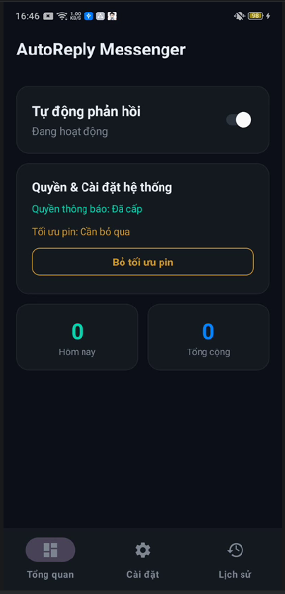
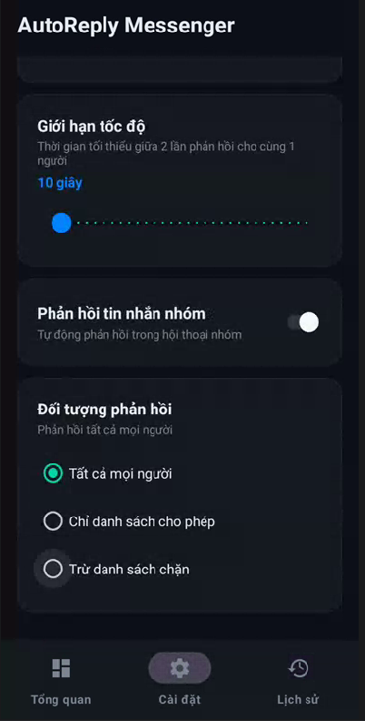

# AutoResponseMessenger

Một ứng dụng Android tự động trả lời tin nhắn, được phát triển bằng Kotlin và Android ViewBinding.

## Tính năng chính

- 🤖 Tự động trả lời tin nhắn đến
- 📱 Giao diện người dùng thân thiện với Material Design
- ⚙️ Tùy chỉnh cài đặt trả lời tự động
- 📜 Lịch sử tin nhắn đã trả lời
- 🔔 Hỗ trợ thông báo

## Giao diện (UI)






## Yêu cầu hệ thống

- **Android tối thiểu:** API 24 (Android 7.0)
- **Android mục tiêu:** API 36
- **Java/Kotlin:** Java 17, Kotlin JVM 21

## Cài đặt

### Clone repository

```bash
git clone <repository-url>
cd AutoResponseMessenger
```

### Build project

Sử dụng Gradle wrapper để build project:

```bash
# Build debug
./gradlew assembleDebug

# Build release
./gradlew assembleRelease

# Cài đặt trực tiếp lên thiết bị
./gradlew installDebug
```

### Yêu cầu Android Studio

- Android Studio Hedgehog hoặc phiên bản mới hơn
- Android SDK 36
- Gradle 8.x

## Cấu trúc dự án

```
app/
├── src/main/
│   ├── java/com/autoreply/messenger/
│   │   ├── assets/          # Tài nguyên hình ảnh
│   │   └── ...              # Source code Kotlin
│   ├── res/                 # Tài nguyên Android
│   └── AndroidManifest.xml
└── build.gradle.kts
```

## Thư viện sử dụng

- **AndroidX Core KTX** (1.12.0) - Tiện ích Kotlin cho Android
- **AndroidX AppCompat** (1.6.1) - Hỗ trợ tương thích ngược
- **Material Components** (1.11.0) - Giao diện Material Design
- **AndroidX RecyclerView** (1.3.2) - Hiển thị danh sách
- **ViewBinding** - Binding view an toàn và nhanh chóng

